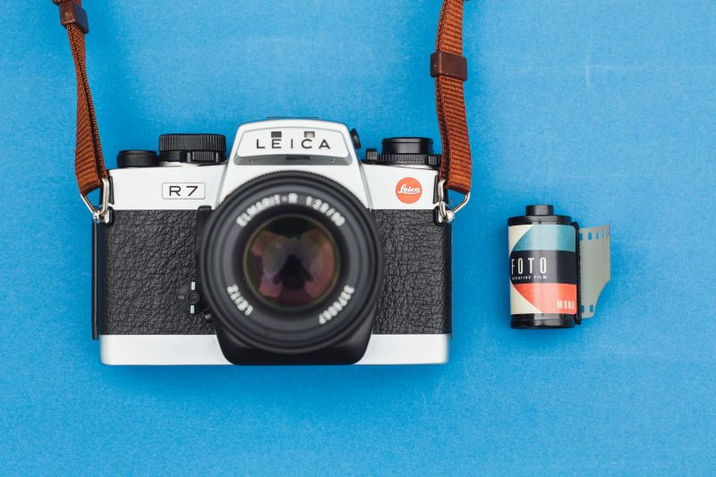

Monica theme is using [Milligram css](https://milligram.io/ "Milligram css") as a main SASS UI framework. Check the documentation for full list of styled elements.
 
  &nbsp;
## Typography {#typography}

Default unit is **rem**. 1rem is equivalent of 10px. Font families can be changed in the theme's config.
 
```
# Heading 1
## Heading 2
### Heading 3
#### Heading 4
##### Heading 5
###### Heading 6
```
 
# Heading 1
## Heading 2
### Heading 3
#### Heading 4
##### Heading 5
###### Heading 6

  &nbsp;
## Emphasis {#emphasis}
```
Emphasis, aka italics, with *asterisks* or _underscores_.
 
Strong emphasis, aka bold, with **asterisks** or __underscores__.
 
Combined emphasis with **asterisks and _underscores_**.
 
Strikethrough uses two tildes. ~~Scratch this.~~
```
 
Emphasis, aka italics, with *asterisks* or _underscores_.
 
Strong emphasis, aka bold, with **asterisks** or __underscores__.
 
Combined emphasis with **asterisks and _underscores_**.
 
Strikethrough uses two tildes. ~~Scratch this.~~

  &nbsp;
## Lists {#lists}
**Numbered list:**
```
1. First list item
2. Another item
3. And another item
4. Last list item
```
1. First list item
2. Another item
3. And another item
4. Last list item
  
 &nbsp;  
 **Bullet list:**
```
- First list item
- Another item
- And another item
- Last list item
```
- First list item
- Another item
- And another item
- Last list item


 &nbsp;  
 **Mixed list:**
```
1. First list item
2. Another item
    - First child item
    - Last child item
```
1. First list item
2. Another item
    - First child item
    - Last child item
 
  &nbsp;    
## Links {#links}
 
```
[I'm an inline-style link](https://www.example.org)
 
[I'm an inline-style link with title](https://www.example.org "Example.org")
 
[You can use numbers for reference-style link definitions][1]
 
Or leave it empty and use the [link-text]
 
[1]: https://www.example.org
[link-text]: https://www.example.org
```
 
[I'm an inline-style link](https://www.example.org)
 
[I'm an inline-style link with title](https://www.example.org "Example.org")
 
[You can use numbers for reference-style link definitions][1]
 
Or leave it empty and use the [link-text]
 
[1]: https://www.example.org
[link-text]: https://www.example.org
 
  &nbsp;
## Buttons {#buttons}
To use HTML in your markdown, you need to enable [raw HTML](#raw-html)
```
<a class="button" href="#">Default Button</a>
<button class="button button-outline">Outlined Button</button>
<input class="button button-clear" type="submit" value="Clear Button">
```
<a class="button" href="#">Default Button</a>
<button class="button button-outline">Outlined Button</button>
<input class="button button-clear" type="submit" value="Clear Button">

  &nbsp;    
## Images {#images}
 
### Default image:
```

```

 
### Figure shortcode:
**Figure with title and caption:**
```
//use curly brackets {{ }} alongside the figure element
< figure 
  src="markus-spiske-unsplash.jpg" 
  title="Unsplash" 
  caption="Photo by Markus Spiske on Unsplash" >
```


&nbsp;  

**Figure with link:**
```
//use curly brackets {{ }} alongside the figure element
< figure 
  src="markus-spiske-unsplash.jpg" 
  title="Photo by Markus Spiske on Unsplash" 
  link="https://unsplash.com/photos/7_a4jxOVxPk"
  target="_blank"
  width="500" >
```


&nbsp;  

**Inline figure:**
```
Aliquam erat volutpat. Quisque ultricies sed ex nec ultricies. Nullam eget bibendum eros. Donec congue purus et quam lobortis euismod. 

//use curly brackets {{ }} alongside the figure element
< figure src="markus-spiske-unsplash.jpg" title="Photo by Markus Spiske on Unsplash" width="250" class="float-left" > Nulla faucibus felis ornare eros volutpat ullamcorper. Nam luctus arcu luctus vestibulum varius. 

Sed aliquet accumsan velit, a tincidunt nulla. Donec sed risus elit. Phasellus nec tincidunt lacus, nec egestas metus. Etiam maximus venenatis mauris vitae facilisis. Curabitur vitae augue efficitur, consequat leo eu, condimentum nisl.
```

Aliquam erat volutpat. Quisque ultricies sed ex nec ultricies. Nullam eget bibendum eros. Donec congue purus et quam lobortis euismod. 

 Nulla faucibus felis ornare eros volutpat ullamcorper. Nam luctus arcu luctus vestibulum varius. 

Sed aliquet accumsan velit, a tincidunt nulla. Donec sed risus elit. Phasellus nec tincidunt lacus, nec egestas metus. Etiam maximus venenatis mauris vitae facilisis. Curabitur vitae augue efficitur, consequat leo eu, condimentum nisl.
 
  &nbsp;    
## Code {#code}

**Inline:**  
```
Inline `code` has `back-ticks around` it.
```
 
Inline `code` has `back-ticks around` it.
 
**Multiline:**
```
function x(a, b){
  return a + b;
}
console.log(x(1, 2));
```

**Highlight:**
```javascript
var s = "JavaScript syntax highlighting";
alert(s);
```
 
```python
s = "Python syntax highlighting"
print s
```
Blocks of code are either fenced by lines with three back-ticks <code>```</code>, or are indented with four spaces. I recommend only using the fenced code blocks -- they're easier and only they support syntax highlighting.
 
  &nbsp;    
## Blockquotes {#blockquotes}
 
```
> Blockquotes are very handy in email to emulate reply text.
> This line is part of the same quote.
 
Quote break.
 
> This is a very long line that will still be quoted properly when it wraps. Oh boy let's keep writing to make sure this is long enough to actually wrap for everyone. Oh, you can *put* **Markdown** into a blockquote. 
```
 
> Blockquotes are very handy in email to emulate reply text.
> This line is part of the same quote.
 
Quote break.
 
> This is a very long line that will still be quoted properly when it wraps. Oh boy let's keep writing to make sure this is long enough to actually wrap for everyone. Oh, you can *put* **Markdown** into a blockquote. 
 
  &nbsp;    
## Grid {#grid}
To use HTML in your markdown, you need to enable [raw HTML](#raw-html)
```
  <div class="row">
    <div class="column">.column</div>
    <div class="column">.column</div>
    <div class="column">.column</div>
    <div class="column">.column</div>
  </div>
  <div class="row">
    <div class="column">.column</div>
    <div class="column">.column</div>
  </div>
  <div class="row">
    <div class="column">.column</div>
  </div>
```

<div class="row">
  <div class="column">
    
  </div>
  <div class="column">
    
  </div>
  <div class="column">
    
  </div>
</div>
<div class="row">
  <div class="column">
    
  </div>
  <div class="column">
    
  </div>
</div>
<div class="row">
  <div class="column">
    
  </div>
</div>


 &nbsp;    
## Tables {#tables}
 
```
Colons "**:**" can be used to align columns.
 
| Tables        | Are           | Cool  |
| ------------- |:-------------:| -----:|
| col 3 is      | right-aligned | $1600 |
| col 2 is      | centered      |   $12 |
| zebra stripes | are neat      |    $1 |
```
 
Colons "**:**" can be used to align columns.
 
| Tables        | Are           | Cool  |
| ------------- |:-------------:| -----:|
| col 3 is      | right-aligned | $1600 |
| col 2 is      | centered      |   $12 |
| zebra stripes | are neat      |    $1 |

&nbsp;
## Horizontal rule (#horizontal-rule)
There are multiple ways how to create horizontal rules
```
Hyphens

---

Asterisks

***

Underscores

___
```
Hyphens

---

Asterisks

***

Underscores

___


  &nbsp;
## Raw HTML {#raw-html}
To enable raw HTML in your markup content, the Goldmark render needs to enable `unsafe=true` configuration. Be aware of potential risks and check documentation about more details [https://gohugo.io/getting-started/configuration-markup/](https://gohugo.io/getting-started/configuration-markup/)

```
// Edit this in your config.toml
[markup]
  [markup.goldmark]
    [markup.goldmark.renderer]
      unsafe = true
```